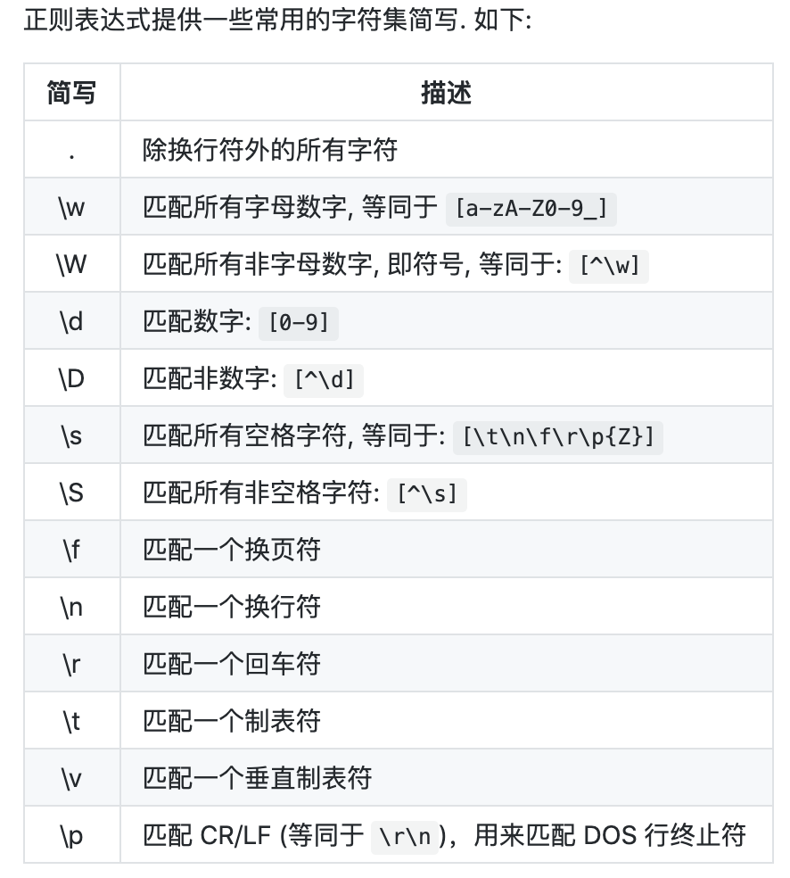

# Regex learn
深入Regex，使用相应的vscode插件和工具

备注：JS文件带数字是为了方便node调试

## target
通过可视化 & flutter|electron 编写一个可视化的Regex工具


## 学习

### 基本匹配
1. 普通的字符串|字符匹配
2. 元字符。元字符写在方括号中会有一些特殊的意义
   
3. 字符集，[Tt]方括号（中括号）表示一个字符集，方括号内部指定字符集范围，方括号内部不关心顺序
4. 字符串否定。^普通表示开头，在中括号里面是表示否定
5. 重复次数。使用元字符 + * ?匹配次数
6. 任意单个字符。使用.
7. 重复。{}量词，1|n个字符重复出现的次数
8. 特征标群。(...)子模式。比如(ab){10}，整个特征标群ab出现10次。同时可以在()里面使用|进行匹配
9. |，或运算符
10. 转码特殊字符。使用\指定`{ } [ ] / \ + * . $ ^ | ? `这些特殊字符
11. 锚点。^和$分别表示开始和结束。
12. 简写字符集
    
13. 零宽度断言。[先行断言和后发断言]。先行断言用于判断所匹配的格式是否在另一个确定的格式之前, 匹配结果不包含该确定格式(仅作为约束).定义一个正先行断言要使用 ()
    ```
    符号	描述
    ?=	正先行断言-存在
    ?!	负先行断言-排除
    ?<=	正后发断言-存在
    ?<!	负后发断言-排除
    ```
14. 标志。大小写i，全局g，多行m。一般的正则工具都会有这种提示。这些标志可以任意使用
15. Greedy vs lazy matching。贪婪匹配和惰性匹配。正则表达式默认采用贪婪匹配模式，在该模式下意味着会匹配尽可能长的子串。我们可以使用 ? 将贪婪匹配模式转化为惰性匹配模式。

