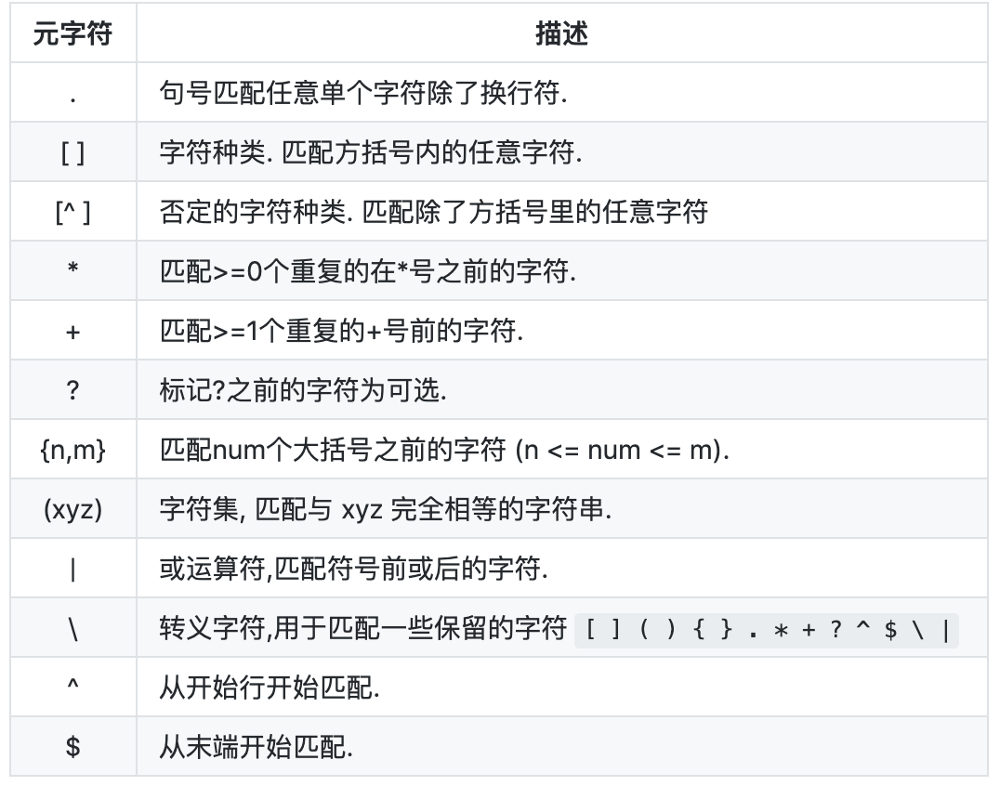

# Regex learn
深入Regex，使用相应的vscode插件和工具

## target
通过可视化 & flutter|electron 编写一个可视化的Regex工具

## 学习

### 基本匹配
1. 普通的字符串|字符匹配
2. 元字符。元字符写在方括号中会有一些特殊的意义
   
3. 字符集，[Tt]方括号（中括号）表示一个字符集，方括号内部指定字符集范围，方括号内部不关心顺序
4. 字符串否定。^普通表示开头，在中括号里面是表示否定
5. 重复次数。使用元字符 + * ?匹配次数
6. 